# Mermaid rendering catalog

This long-page fixture exercises every diagram family registered by the bundled Mermaid 11.17.2 core build. Each heading names the syntax under test; one broken render should not prevent later diagrams from appearing.

## Flow and process diagrams

### Flowchart

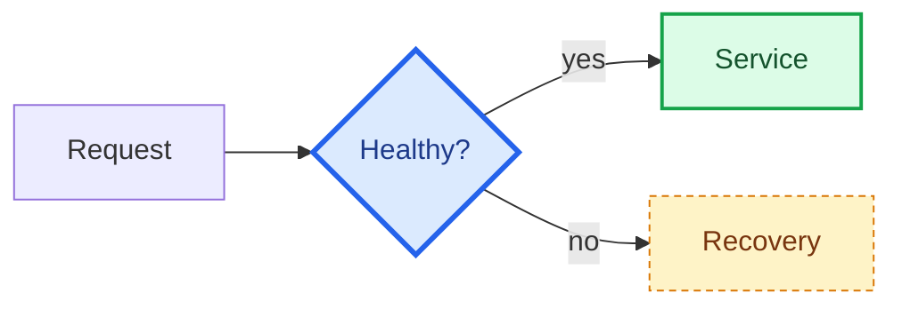

### Legacy graph alias

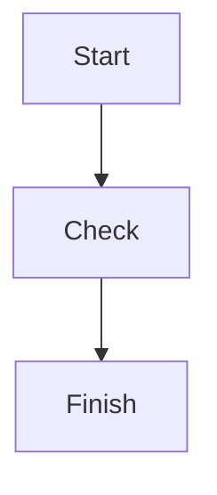

### ELK flowchart layout

```mermaid
flowchart-elk LR
  Client[Client applications and service consumers] --> Edge[Global edge network and TLS termination]
  Edge --> Gateway[Regional API gateway and request routing]
  Gateway --> Identity[Identity validation and policy evaluation]
  Identity --> Mesh[Service mesh and workload discovery]
  Mesh --> Compute[Stateless request processing tier]
  Compute --> Queue[Durable events and retry queue]
  Queue --> Store[Multi-region persistence and data systems]
  Store --> Analytics[Reporting and audit pipeline]
```

### Swimlane

```mermaid
swimlane-beta LR
  subgraph customer[Customer]
    request[Submit request] --> confirm[Confirm result]
  end
  subgraph service[Service team]
    review[Review request] --> resolve[Resolve issue]
  end
  request --> review
  resolve --> confirm
```

### User journey

The actor legend uses colored dots to identify people; matching dots on a task show who participates. Each task score ranges from 1 to 5.

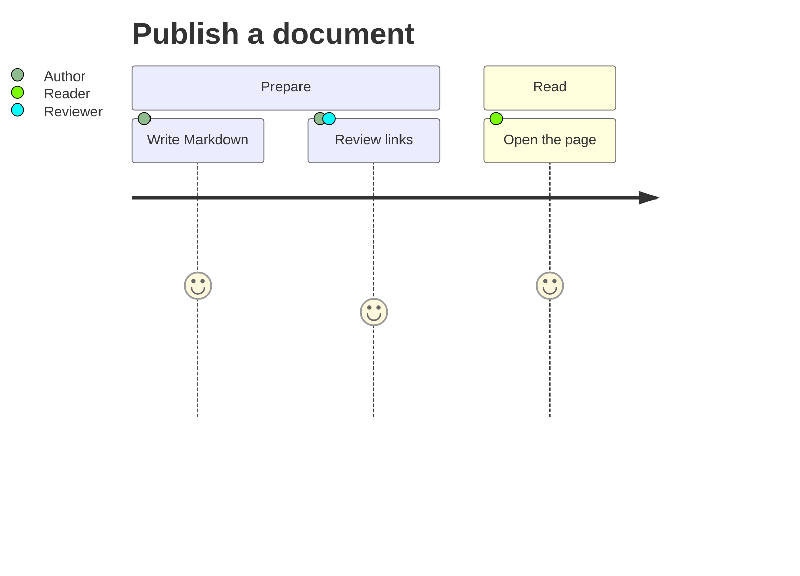

### Gantt schedule

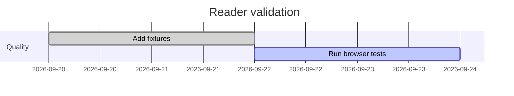

### Event modeling

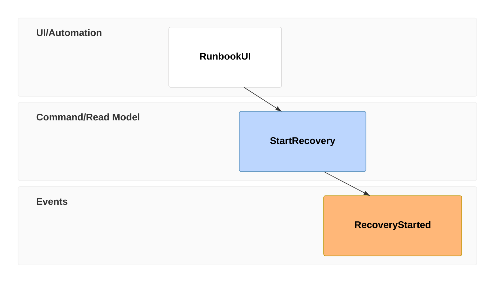

## Data and analysis diagrams

### Pie chart

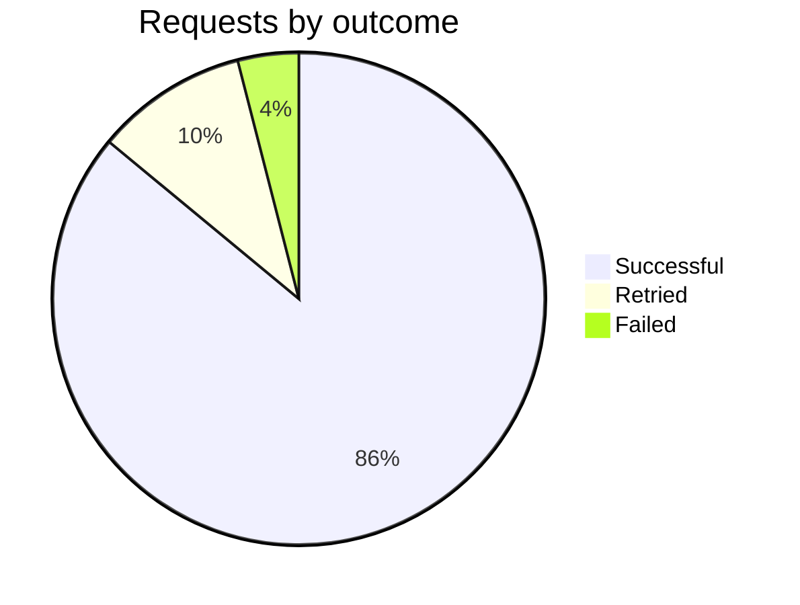

### Quadrant chart

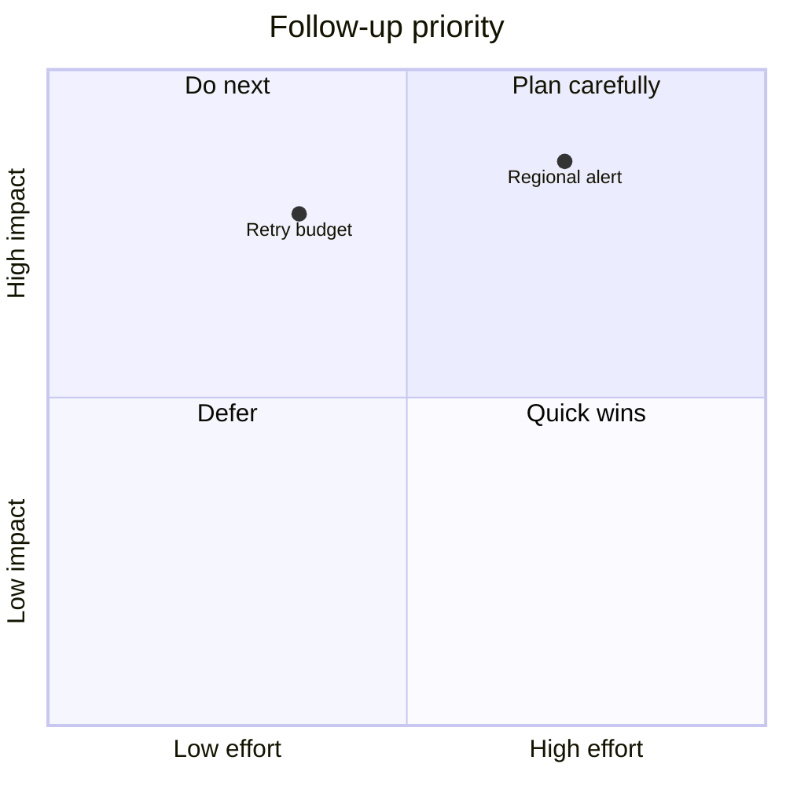

### XY chart

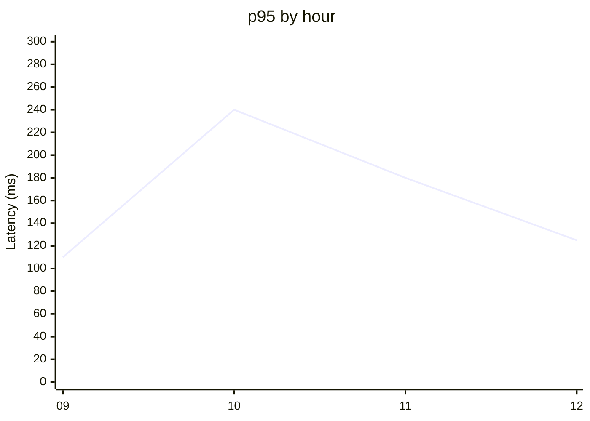

### Sankey flow

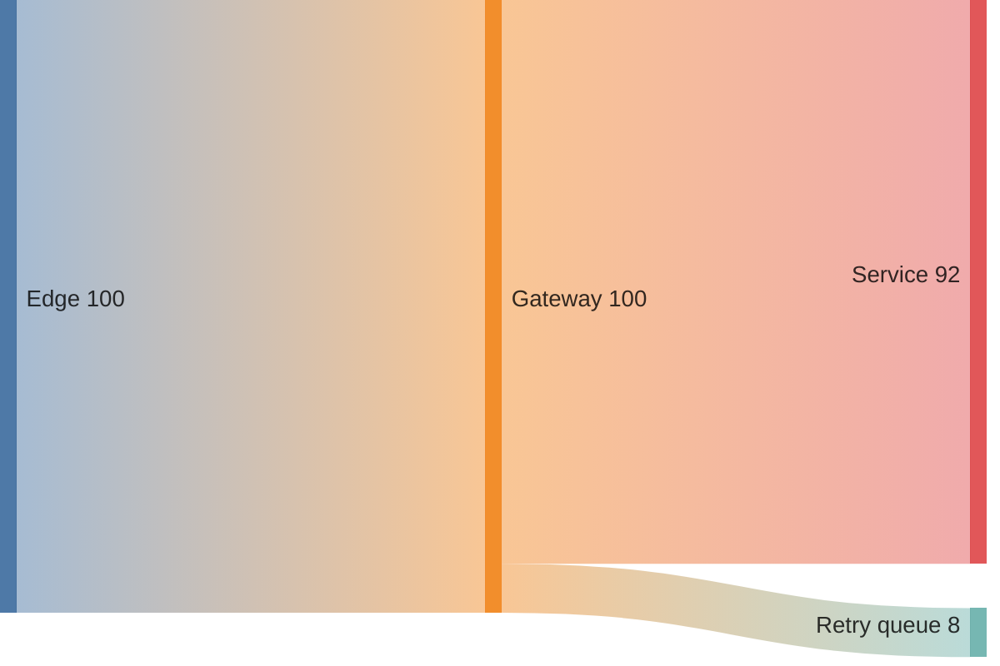

### Radar chart

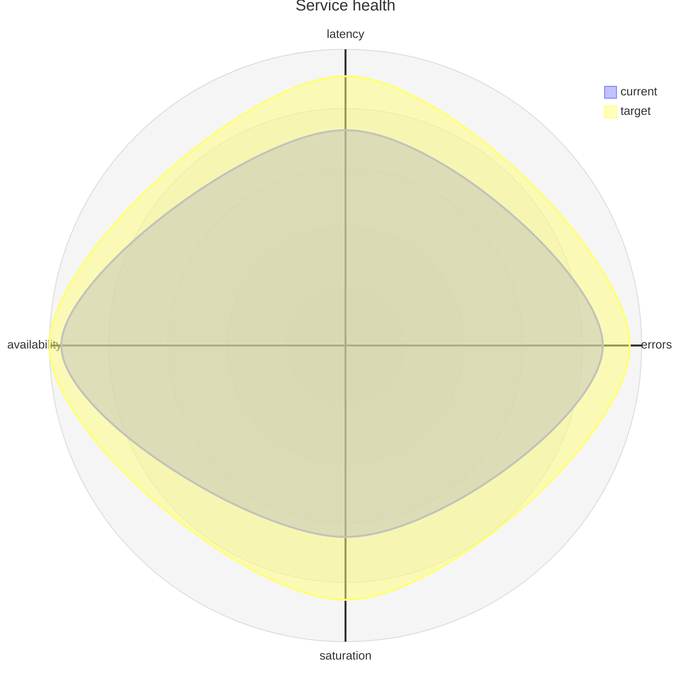

### Treemap

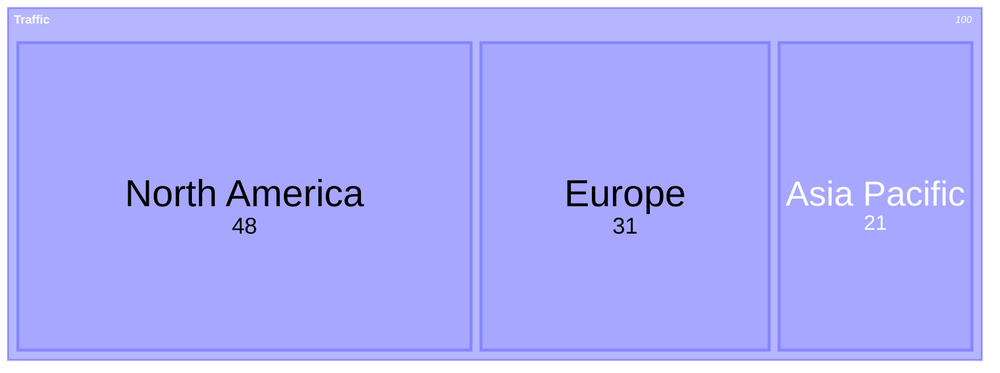

### Venn diagram

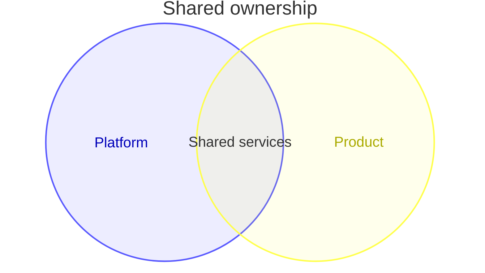

## Data models and architecture

### Entity relationship

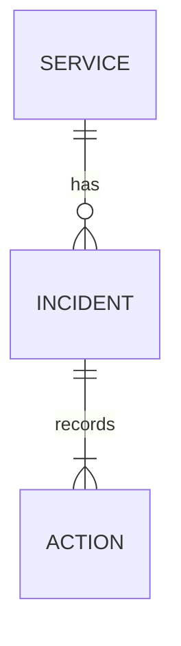

### Class diagram

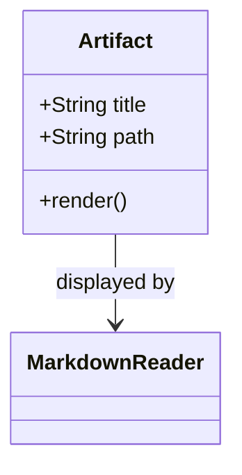

### Class diagram v2 alias

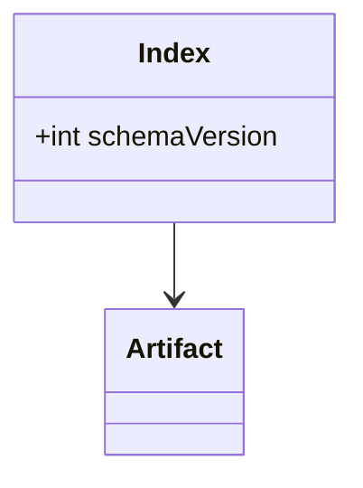

### Git graph

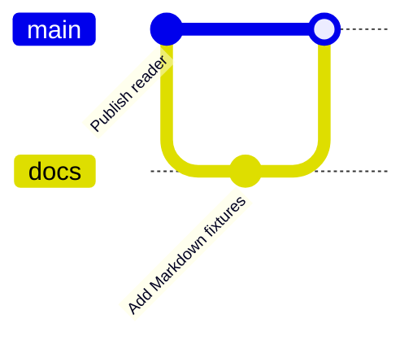

### C4 system context

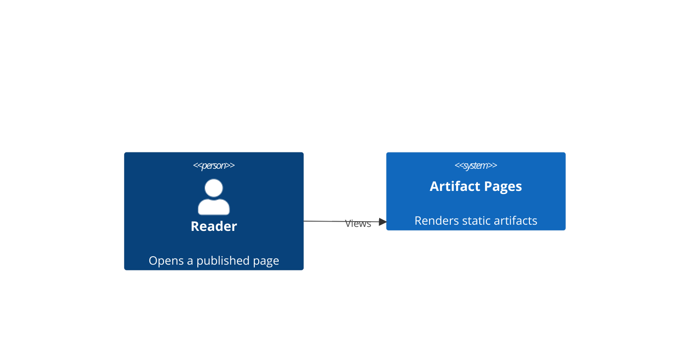

### Architecture

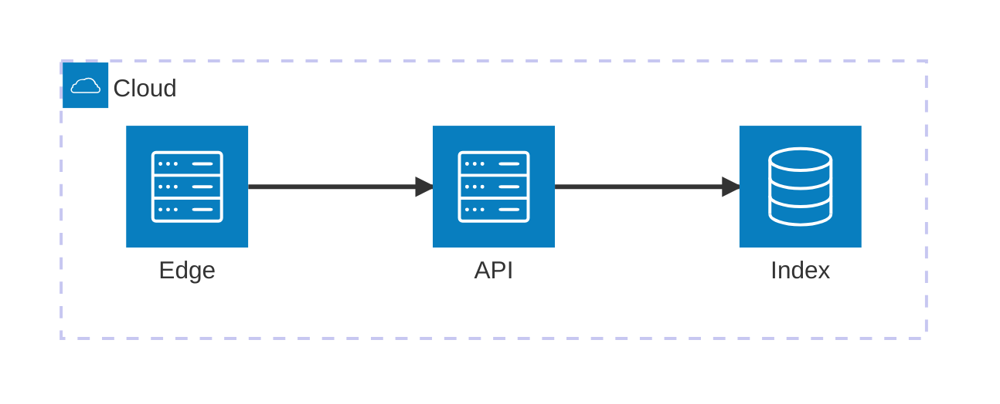

### Block diagram

```mermaid
block
  columns 3
  Client Gateway Store
  Client --> Gateway
  Gateway --> Store
```

### Packet layout

```mermaid
packet-beta
  0-7: "Version"
  8-15: "Flags"
  16-31: "Payload length"
```

### Kanban

```mermaid
kanban
  todo[To do]
    fixtures[Add fixture coverage]
  doing[In progress]
    render[Validate diagram rendering]
  done[Done]
    review[Review results]
```

### Directory tree

```mermaid
treeView-beta
  site/
    guides/
      index.md
    diagrams/
      catalog.md
```

## Language and state diagrams

### Sequence diagram

```mermaid
sequenceDiagram
  Author->>Builder: Build index
  Builder-->>Reader: Publish metadata
```

### State diagram

```mermaid
stateDiagram-v2
  [*] --> Draft
  Draft --> Published
  Published --> [*]
```

### Legacy state alias

```mermaid
stateDiagram
  [*] --> Ready
  Ready --> Done
```

### Mind map

```mermaid
mindmap
  root((Reader))
    Documents
      HTML
      Markdown
    Navigation
      Search
      Contents
```

### Requirement diagram

```mermaid
requirementDiagram
  requirement render {
    id: R1
    text: Documents must render safely
    risk: medium
    verifymethod: test
  }
  element reader {
    type: Application
    docref: Markdown reader
  }
  reader - satisfies -> render
```

### Timeline

```mermaid
timeline
  title Reader milestones
  2026-09 : Add Markdown support
           : Add Mermaid fixtures
  2026-10 : Review rendering coverage
```

## Newer and specialized diagrams

### Ishikawa cause analysis

```mermaid
ishikawa-beta
  Markdown preview failures
    Asset path resolution
      Incorrect base URL
    Diagram rendering
      Unsupported syntax
    Reader styles
      Missing heading rules
```

### Wardley map

```mermaid
wardley-beta
  title Reader capabilities
  anchor Reader [0.9, 0.9]
  component Markdown [0.7, 0.6]
  component Static assets [0.5, 0.8]
  Reader -> Markdown
```

### Cynefin framework

```mermaid
cynefin-beta
  title Triage approach
  clear
    "Follow the runbook"
  complicated
    "Ask a subject-matter expert"
  complex
    "Run a small experiment"
  chaotic
    "Stabilize first"
  confusion
    "Classify the unknown"
```

### Railroad grammar

```mermaid
railroad-beta
  title "Identifier"
  identifier = sequence(
    terminal("letter"),
    zeroOrMore(choice(terminal("letter"), terminal("digit")))
  ) ;
```

### EBNF railroad grammar

```mermaid
railroad-ebnf-beta
  identifier = letter ( letter | digit )* ;
  letter = "a" | "b" ;
  digit = "0" | "1" ;
```

### ABNF railroad grammar

```mermaid
railroad-abnf-beta
  identifier = ALPHA *( ALPHA / DIGIT ) ;
```

### PEG railroad grammar

```mermaid
railroad-peg-beta
  Identifier <- Letter ( Letter / Digit )* ;
  Letter <- "a" / "b" ;
  Digit <- "0" / "1" ;
```

### Mermaid diagnostic info

```mermaid
info
```

## Not in the bundled Mermaid core

The following examples deliberately use diagram types that require Mermaid 12 or an external diagram plugin. The reader should show their source fallback rather than silently omit them.

### Use case diagram (Mermaid 12+)

```mermaid
usecase-beta
  actor Reader
  Reader --> (Open page)
```

### ZenUML (external plugin)

```mermaid
zenuml
  Reader->>App: Open page
```
