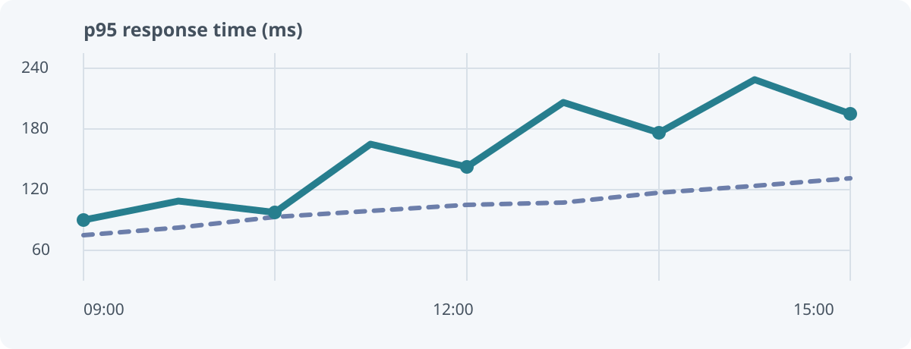

# Markdown styles in the reader

This page is a visual regression fixture for a long-form guide. It intentionally combines standard Markdown, GitHub Flavored Markdown, safe inline HTML, and assets from different locations.

> **Editorial note**
>
> A useful reader should keep the writing quiet and let the document's own structure lead.
>
> Nested quotations should remain legible without turning into a card inside a card.

## Type and hierarchy

Use **bold emphasis**, *italics*, ~~strike-through~~, `inline code`, and a [descriptive link](https://example.invalid/guide). A bare URL such as https://example.invalid/docs should also become a link.

### A subsection with a long heading: observations from the edge

#### A fourth-level heading

##### A fifth-level heading

###### A sixth-level heading

The heading below contains punctuation and non-ASCII text; the Contents target should still land on the right place.

### 障害対応 — 日本語の見出し

Repeated headings need unique anchor IDs.

### Repeated heading

### Repeated heading

## Lists and task status

- A short unordered item
  - A nested item with a [relative Markdown link](../runbooks/service-recovery.md)
  - A second nested item
- Another top-level item

1. First ordered step
2. Second ordered step
   1. A nested ordered step

- [x] Verify the edge response
- [ ] Compare regional latency

## Tables and data

| Region | p95 latency | Change |
| :--- | ---: | :---: |
| North America | 184 ms | +12% |
| Europe | 121 ms | −3% |
| Asia Pacific, primary | 203 ms | +8% |

The GFM table above exercises left, right, and centered alignment as well as a longer cell value.

## Code, keyboard input, and quotations

Press <kbd>⌘</kbd> + <kbd>K</kbd> to open the command palette. Configuration snippets should remain readable and horizontally scroll when needed:

```json
{
  "site": "sre",
  "reader": "markdown",
  "features": ["tables", "tasks", "diagrams", "relative assets"]
}
```

> A nested quote can contain a second paragraph.
>
> - and a list
> - without losing its left edge

<details>
<summary>Raw HTML disclosure</summary>

This native disclosure should remain usable while unsafe elements are removed.

</details>

## Images and resource boundaries

The first image is a wide local SVG and should scale to the reader width. The second resolves through a parent directory; the third is a live HTTPS image, as in a regular browser.




The following intentionally unavailable local image should show its alt text without breaking the document: .

The next two are also deliberate negative cases: cross-site storage is outside this site's artifact namespace, and insecure HTTP is not an allowed remote resource. Their references must not be fetched:


## Links and raw HTML safety

- [Open the incident review](../incidents/checkout-latency/index.html)
- [Open the runbook](../runbooks/service-recovery.md)
- [Send feedback](mailto:docs@example.invalid)
- [Open the external guide](https://example.invalid/guide)
- [Jump to the Japanese heading](#障害対応--日本語の見出し)

<script>window.__markdownUnsafeHtmlExecuted = true</script>

<iframe src="https://example.invalid/embed"></iframe>

[^note]: Footnote content is included to exercise the GFM footnote extension.

This sentence has a footnote reference.[^note]
